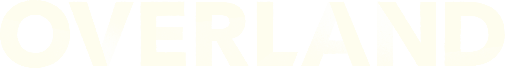
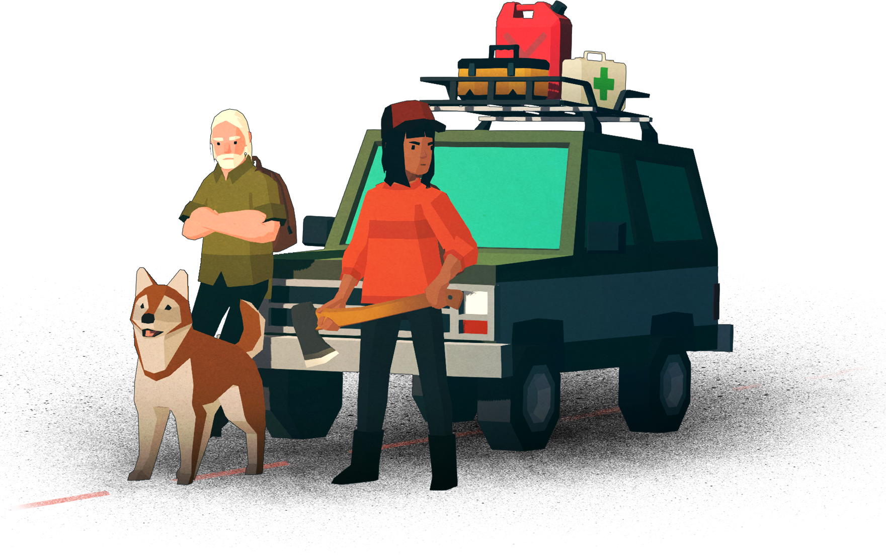
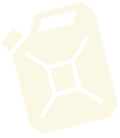
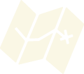
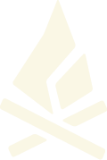
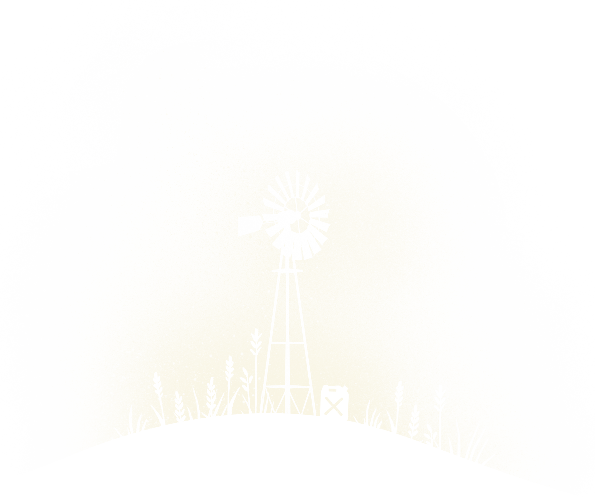

### Correção arquivo a.html
* Adicionado `<!DOCTYPE html>` no começo
* Adicionado `<title>a</title>`
* Adicionado atributo `lang="en-us"`

### Correção do arquivo Overland.html
* Retirado os comentários do início
* Retirado a linha 7: 
~~~
<meta http-equiv="content-type" content="text/html; charset=UTF-8">
~~~
* Retirado "chrome=1" da linha 10
* Substitiído o segmento da linha 244: 
~~~
"<iframe title="o desafio reCAPTCHA expira em dois minutos" src="Overland_arquivos/bframe.html" style…llow-modals allow-popups-to-escape-sandbox allow-storage-access-by-user-activation" frameborder="0">"
~~~
Por:
~~~
"<iframe style="overflow:hidden;">"
~~~

### Descrição alternativa da imagem
Descrições alternativas que não continham no site

~~~html

~~~

~~~html

~~~

~~~html

~~~

~~~html

~~~

~~~html

~~~

~~~html

~~~

~~~html

~~~

~~~html

~~~

