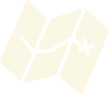
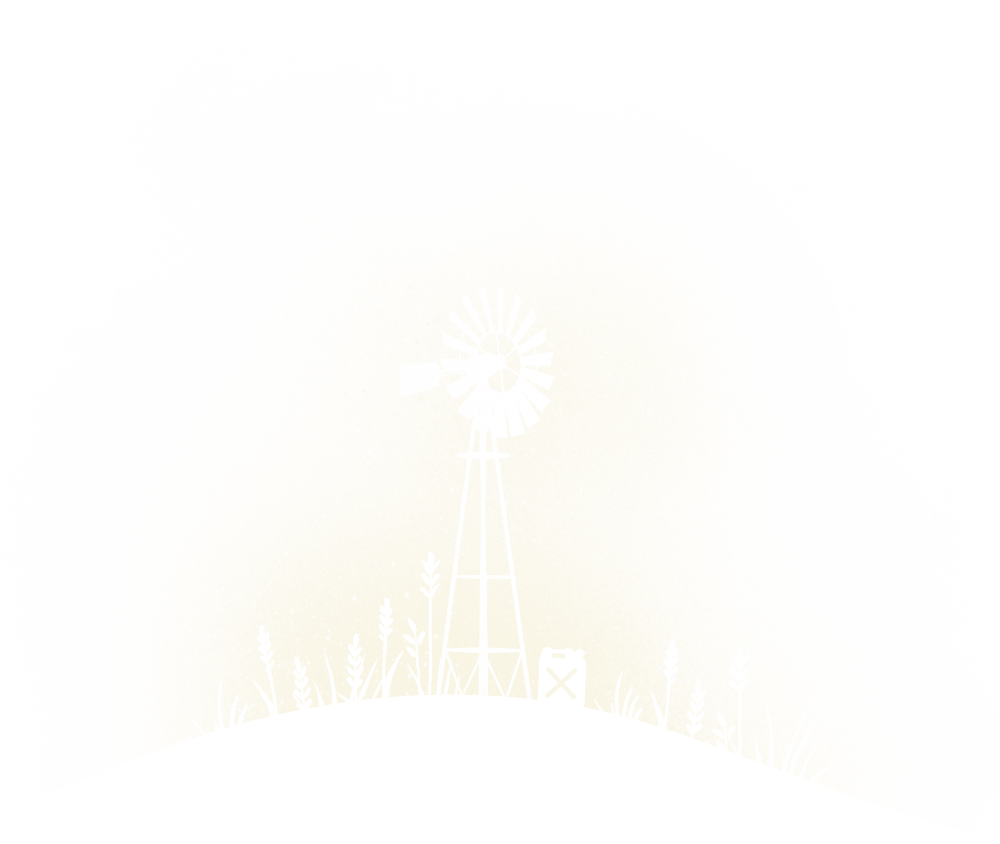

# Avaliação de acessibilidade web

Guilherme Oliveira - 2127954
Tiago Silva - 2023644

# Descrição do trabalho

Website escolhido para avaliação foi 
~~~
https://overland-game.com/
~~~

Trata-se de um jogo que se diz acessível para pessoas com dislexia.

## Correções dos arquivos .html

### Correção arquivo a.html
* Adicionado `<!DOCTYPE html>` no começo
* Adicionado `<title>a</title>`
* Adicionado atributo `lang="en-us"`

### Correção do arquivo Overland.html
* Retirado os comentários do início
* Retirado a linha 7: 
~~~
<meta http-equiv="content-type" content="text/html; charset=UTF-8">
~~~
* Retirado "chrome=1" da linha 10
* Substitiído o segmento da linha 244: 
~~~
"<iframe title="o desafio reCAPTCHA expira em dois minutos" src="Overland_arquivos/bframe.html" style…llow-modals allow-popups-to-escape-sandbox allow-storage-access-by-user-activation" frameborder="0">"
~~~
Por:
~~~
"<iframe style="overflow:hidden;">"
~~~
* Substitiído o segmento da linha 307: 
~~~
"<iframe title="o desafio reCAPTCHA expira em dois minutos" src="Overland_arquivos/bframe.html" style…llow-modals allow-popups-to-escape-sandbox allow-storage-access-by-user-activation" frameborder="0"></iframe>"
~~~
Por:
~~~
"<iframe style="overflow:hidden;"></iframe>"
~~~

### Correção do anchor.html
* Substituído o segmento da linha 2:
~~~
pt_br
~~~
Por:
~~~
pr-br
~~~
* Substituída a linha 185:
~~~
</script>

reCAPTCHA requer verificação. 

<label class="rc-anchor-center-item rc-anchor-checkbox-label" aria-hidden="true" role="presentation" id="recaptcha-anchor-label">Não sou um robô</label>

reCAPTCHA

<a href="https://www.google.com/intl/pt-BR/policies/privacy/" target="_blank">Privacidade</a> - <a href="https://www.google.com/intl/pt-BR/policies/terms/" target="_blank">Termos</a>

~~~
Por:
~~~
"</script>

reCAPTCHA requer verificação. 

<label class="rc-anchor-center-item rc-anchor-checkbox-label" aria-hidden="true" id="recaptcha-anchor-label">Não sou um robô</label>

reCAPTCHA

<a href="https://www.google.com/intl/pt-BR/policies/privacy/" target="_blank">Privacidade</a>
 - 
<a href="https://www.google.com/intl/pt-BR/policies/terms/" target="_blank">Termos</a>

<iframe style="display: none;"></iframe></body></html>"
~~~

### Correção do bframe.html
* Substituído o segmento da linha 2:
~~~
pt_br
~~~
Por:
~~~
pr-br
~~~

### Descrição alternativa das imagens
Descrições alternativas que não continham no site

~~~html

~~~

~~~html

~~~

~~~html

~~~

~~~html

~~~

~~~html

~~~

~~~html

~~~

~~~html

~~~

~~~html

~~~

## Correções dos arquivos .css

O único erro encontrado no arquivo main_launch.css apontado pelo validador
~~~
Erro de valor : font-weight 600px não é um valor font-weight : 600px
~~~

Na linha 258 foi atualizado de `font-weight: 600px;` para `font-weight: 600;`

## Correções dos arquivos .js

### Correção arquivo api_002.js
Não foi encontrado nenhum erro grave, somente warnings. Foram corrigidos alguns deles abaixo:

1. **tirado agrupamento de função por parênteses**
~~~js
(function () {
    ...
}).call(this)
~~~
para
~~~js
func = function () {
    ...
};

func..call(this);
~~~

2. **Declarado uma variável por linha**
~~~js
var domain, url, xhr;
~~~
para
~~~js
var domain; 
var url; 
var xhr;
~~~

3. **Checagem de null com operador `===`**
~~~js
if (opts == null)
~~~
para
~~~js
if (opts === null)
~~~

## Correções de acessibilidade

### validador WAVE
* Adicionado linguagem `en-us` em `lang="en-us"`
* Todos os erros de texto alternativos para imagem foram corrigidos
* Alguns botões estão com pouco constraste com texto na cor #FAF7E5 e background #F9423A
Foi ajustado isso mudando o background para a cor #952622
* Corrigido texto com head`h3` sem head `h2`, mudado para head `h2`

### Falsos positivos
* FALSO POSITIVO: o software indicou que há links sem texto, porém os links não são clicáveis, eles são imagens.

* FALSO POSITIVO: link para vídeo do youtube. O problema não é o link em si, o problema é que o vídeo não tem narração, é somente visual e não tem legendas.